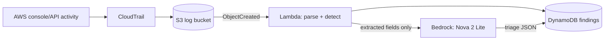

# AI-Assisted Security Log Triage

Detects risky AWS changes from CloudTrail logs and uses an LLM on Amazon Bedrock to explain and prioritize them.

```mermaid
flowchart LR
  A[AWS console/API activity] --> B[CloudTrail]
  B --> C[(S3 log bucket)]
  C -->|ObjectCreated| D[Lambda: parse + detect]
  D --> E[(DynamoDB findings)]
  D -->|extracted fields only| F[Bedrock: Nova 2 Lite]
  F -->|triage JSON| E
```
